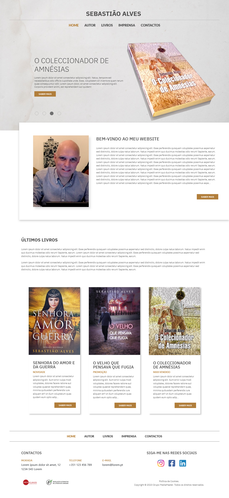
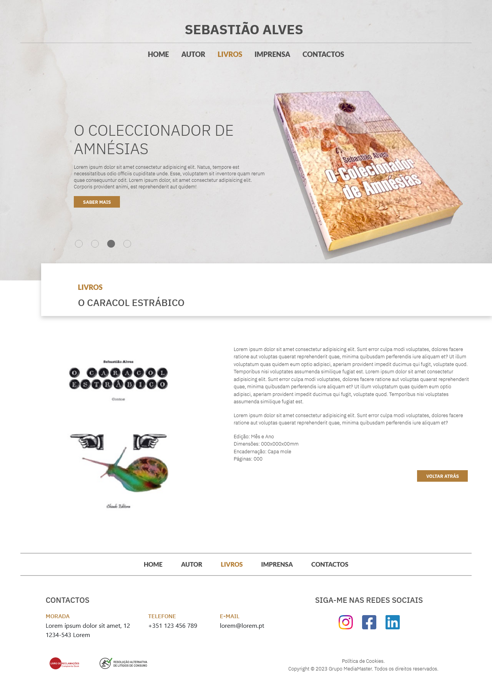
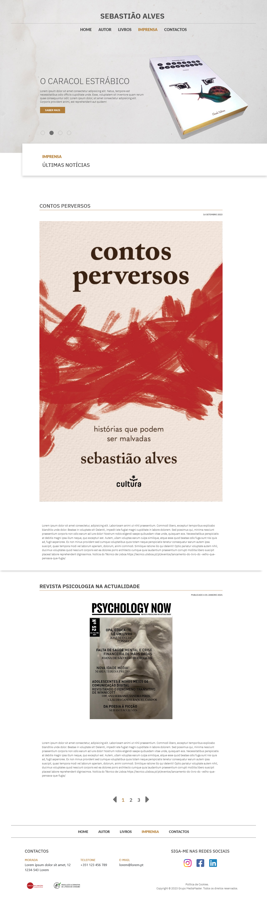

# Sebastiao Alves

## Table of contents

- [Overview](#overview)
  - [The project](#the-project)
  - [Screenshot](#screenshot)
- [My process](#my-process)
  - [Built with](#built-with)
- [Author](#author)

## Overview

### The Project

I was tasked with making a responsive website for an Autor using everything I have learned. It is a complete functional website with various pages, database and backoffice, so the author can change anything, from images and text to the order in wich they are displayed.
I have included some screenshots but I can´t include everything.😁

### Screenshot

, , ,

## My process

### Built with

- Semantic HTML5 markup
- CSS custom properties
- Flexbox
- CSS Grid
- PHP
- JavaScript
- SQL
- Bootstrap

## Author

- Website - [Irina](https://irinakrdmva.pt)
- Frontend Mentor - [@IrinaKrdmva](https://www.frontendmentor.io/profile/IrinaKrdmva)
